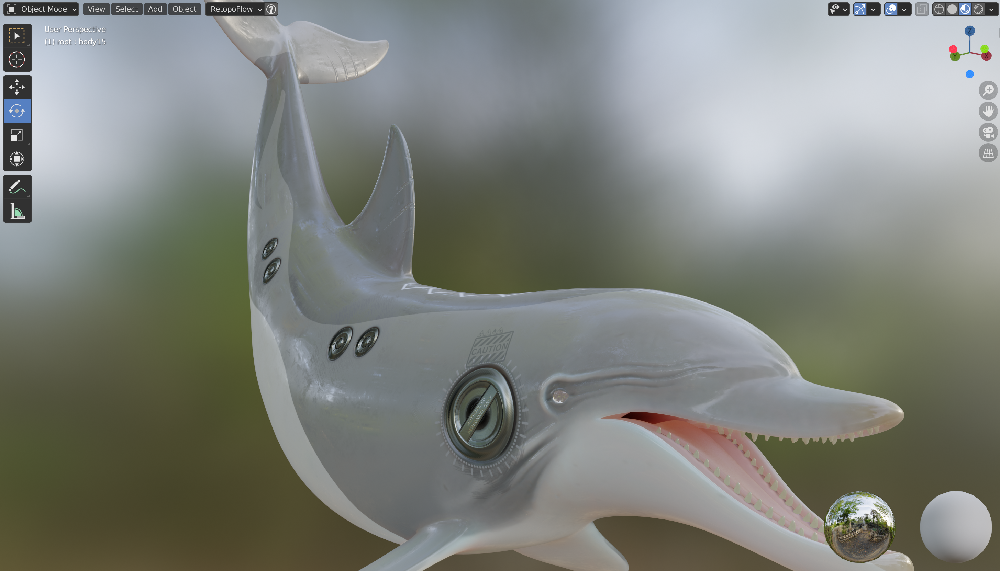
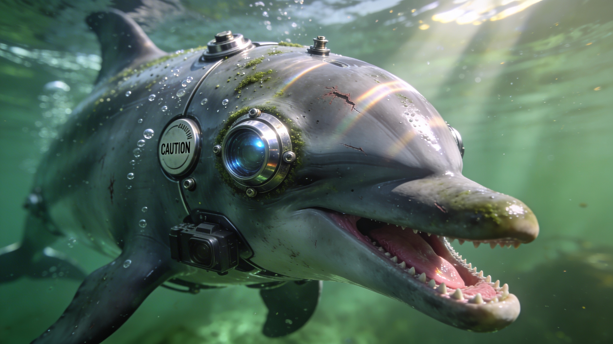

# Character Sheet - Doll-Phin Bioroid

## 1. Identity

- **Name:** Doll-Phin
- **Alias(es):** Doll-Phin Bioroid (originally designated DOLL-7), Dolly
- **Type:** Bio-robotic hybrid
- **Role:** Story character. A military unit.
- **Demographics (optional):** Aquatic. Sentient AI.

## 2. Physical

- **Build:** Dolphin-based body — partly organic (real dolphin biology), partly synthetic materials.
- **Distinctive traits:** Aquatic. Exact appearance TBD.
- **Voice/speech (optional):** TBD.
- **Morphology (if hybrid/alien):** Hybrid of a real bottlenose dolphin and synthetic/bio-robotic materials. A military engineering product.

## 3. Psychological / temperament

- **Personality:** Unknown past makes his current motivations unclear. Autonomous — acts on his own agenda since resuming operation.
- **Drives:** Unknown. Current objectives are a mystery.
- **Fears:** TBD.
- **Flaws / weaknesses:** TBD.
- **Secrets or hidden need:** TBD.
- **Notable habits:** TBD.

## 4. Backstory

- **Origin:** Military development — designed to spy and scout the enemy. A hybrid of a real dolphin and synthetic materials.
- **Key past events:**
  - Disabled and thrown away on a junkyard (reason unknown)
  - By accident, resumed operation on his own
  - Improved his own specifications after reactivation
  - Current tasks and allegiances are unknown
- **Ties to the world:** Originally part of the military-industrial complex. Now operating independently.

## 5. Relationships

- **Allies:** TBD.
- **Enemies:** TBD.
- **Dependents / others:** TBD.
- **Public perception (optional):** TBD.

## 6. Abilities and equipment

- **Skills:** Espionage and scouting (original function). Aquatic movement and combat.
- **Weapons / gear:** Built-in military specifications (details TBD).
- **Special capabilities:** Self-improvement — was able to upgrade his own specifications after reactivation. AI-driven autonomy.

## 7. Story usage

- **Appearances:** TBD.
- **Plot function:** TBD. His blurred past and self-improved capabilities make him an unpredictable element.
- **Possible arcs:** Discovering why he was discarded. What his current mission is. Potential ally or threat.
- **Archetype (optional):** Military unit; the unknown variable.

## 8. References

