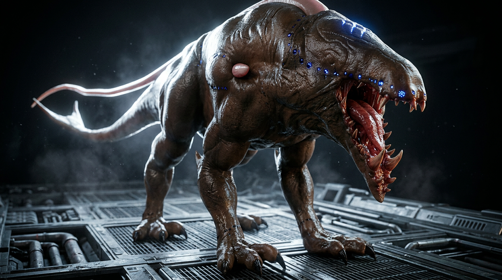

# Character Sheet - Stalker

## 1. Identity

- **Name:** Stalker
- **Alias(es):** Tentaculo
- **Type:** Unknown origin — not a hybrid, not human. True nature undetermined.
- **Role:** The most dangerous inhabitant of the underground. Guardian of [Mara](Mara.md). Key figure in [Jasmine Foster's](Jasmine Foster.md) flashback arc.
- **Demographics (optional):** Unknown age. Sentient.

## 2. Physical

- **Build:** Bipedal. Exact dimensions TBD.
- **Distinctive traits:** Sharp teeth / toothed jaws. Three tentacles: two on the sides (forward-facing, 10 m each, with flower-bud tips that release pollen/scent) and one rear tentacle (~10 m, extends backward from between neck and spine, reproductive function). Each tentacle tip has a bud-like formation. Extremely dangerous appearance.
- **Voice/speech (optional):** TBD.
- **Morphology (if hybrid/alien):** Unknown. Origin is a mystery.

## 3. Psychological / temperament

- **Personality:** Sentient and intelligent. Extremely territorial.
- **Drives:** Guarding [Mara](Mara.md). Ruling the sewers.
- **Fears:** TBD.
- **Flaws / weaknesses:** TBD.
- **Secrets or hidden need:** TBD.
- **Notable habits:** Nobody has ever seen the Stalker — not beasts, not people. Anyone who catches a glimpse is killed immediately.

## 4. Backstory

- **Origin:** Born in the sewers. True origin unknown.
- **Key past events:** TBD.
- **Ties to the world:** Lives in the sewers beneath the metropolis. Guardian of [Mara](Mara.md), the witch.

## 5. Relationships

- **Allies:** [Mara](Mara.md) — serves as her guardian/protector.
- **Enemies:** Anyone who enters his territory uninvited.
- **Dependents / others:** TBD.
- **Public perception (optional):** A legend in the underground — the most ferocious inhabitant. Nobody has seen him and lived to tell about it.

## 6. Abilities and equipment

- **Skills:** Stealth, lethal combat.
- **Weapons / gear:** Natural weapons — sharp teeth, jaws, and three tentacles (see Physical section).
- **Special capabilities:** TBD.

## 7. Story usage

- **Appearances:** Encounters with [Jasmine Foster](Jasmine Foster.md) and [Lizardman](Lizardman.md). Key role in the flashback arc.
- **Plot function:** Will take [Jasmine Foster](Jasmine Foster.md) to the desert, through a temporal rift into the past, where she will witness who she was in a previous life — playing as the slave ([Iras](Iras.md)) who was gifted to [Alekandras](Alekandras.md). This is one of the key flashback events in the story.
- **Possible arcs:** TBD.
- **Archetype (optional):** Unseen terror; unlikely guide.

## References
